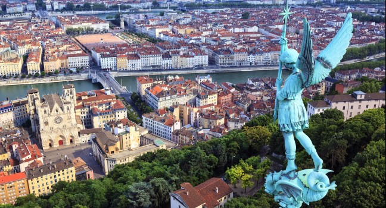
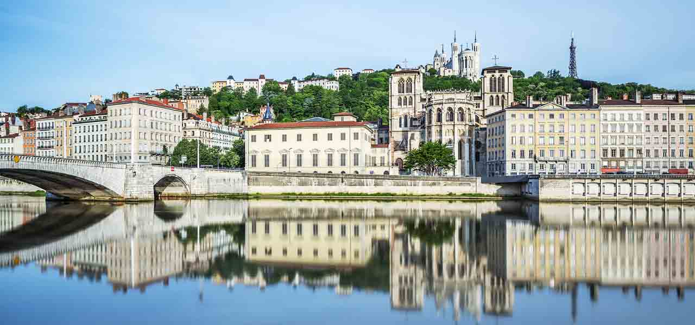

### Once upon a time… 
This is how all great stories begin - and believe me this one is really great 
(especially if you are Bulgarian in a foreign country).

It all started here, in our beautiful city Lyon, in the distant 2011.  
A group of non-professional dancers decided to create a small dance group. 
I still don’t know how the idea was born, maybe it was the love of dance, 
maybe they were home sick or maybe there were searching for something – 
something you can find only by experience the Bulgarian dances.   

To be honest I don’t care why they started the group – I’m just grateful they did. 
Without it I was going to miss so many amazing memories: new places, new people…  
I always wanted to travel, see the world, but never imagined that I was going to journey around Europe 
(for now, it’s about time we take a trip to another continent) with a dance crew 
(mainly because I used to be a terrible dancer). 
